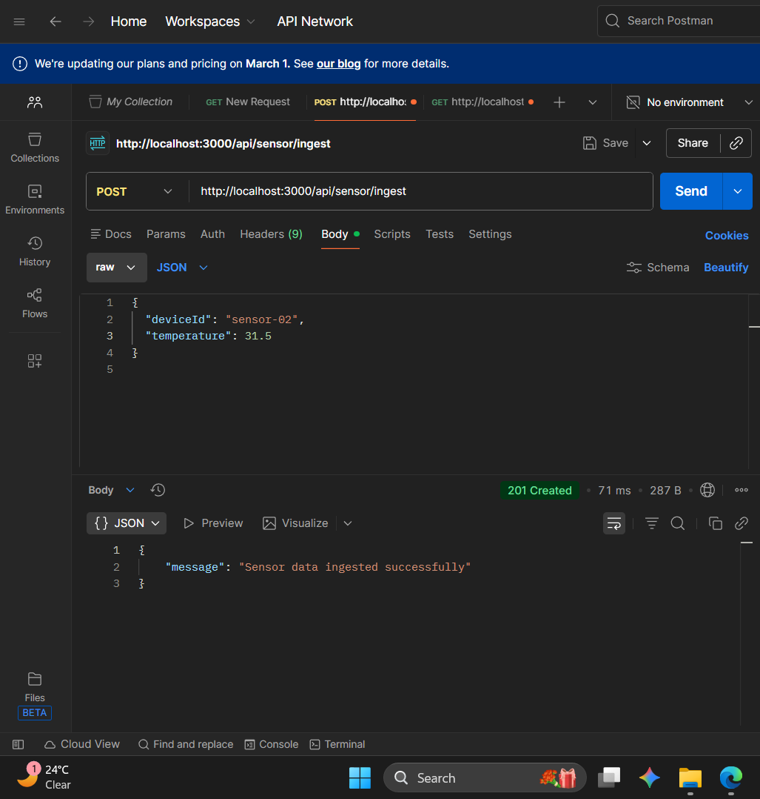
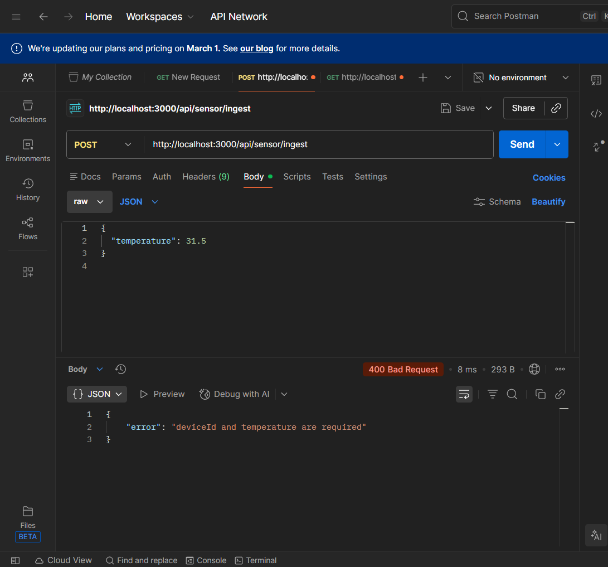
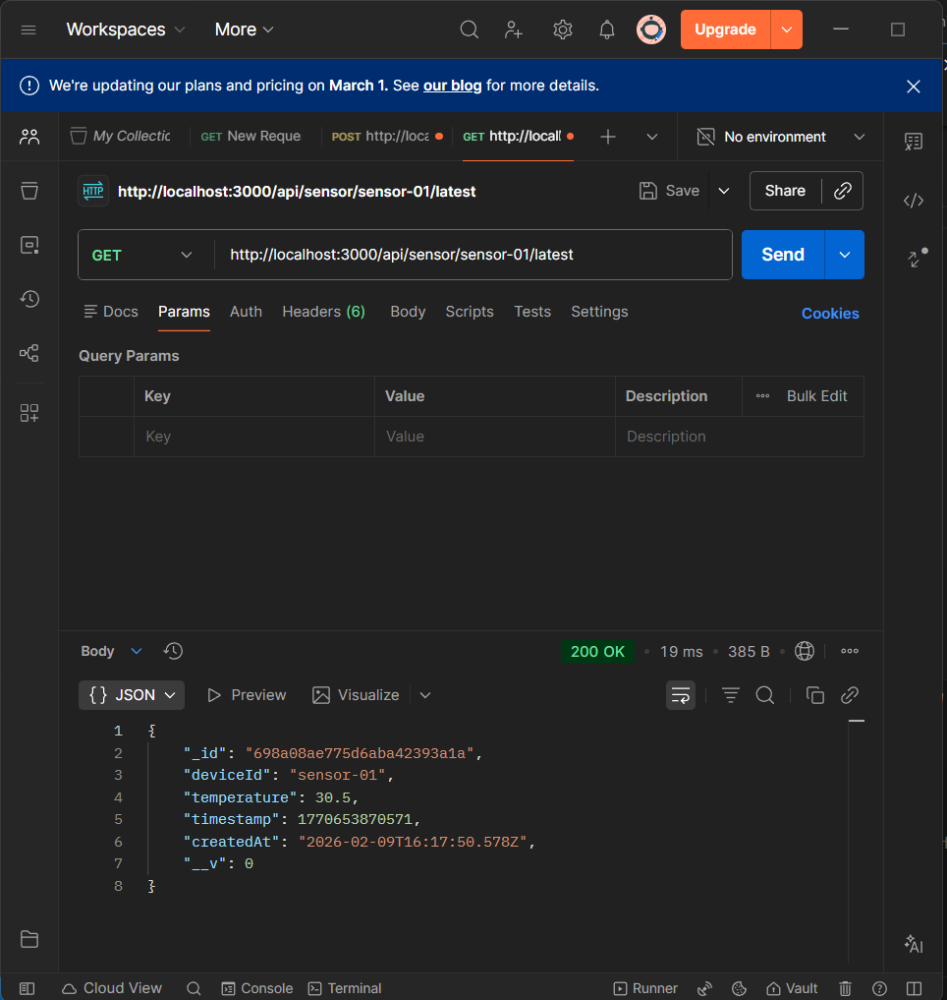

# IoT Sensor Backend

REST API for ingesting and retrieving IoT sensor temperature data.

## Features

- Ingest sensor temperature readings via POST endpoint
- Retrieve latest reading for any device via GET endpoint
- Input validation and error handling
- MongoDB Atlas integration for persistent storage

## Installation

```bash
git clone https://github.com/pranavthaivalappil/Faclon_Internship_Assignment.git
cd Faclon_Internship_Assignment
npm install
```

## Configuration

Create a `.env` file:

```env
MONGO_URI=mongodb+srv://<username>:<password>@cluster0.xxxxx.mongodb.net/iotSensors?retryWrites=true&w=majority
```

## Usage

Start the server:

```bash
node app.js
```

Server runs on `http://localhost:3000`

## Data Schema

Sensor data is stored in MongoDB with the following fields:

- `deviceId` (String, required) - Unique identifier for the sensor device
- `temperature` (Number, required) - Temperature reading in degrees
- `timestamp` (Number, required) - Unix timestamp of the reading
- `createdAt` (Date) - Auto-generated document creation timestamp

## API Endpoints

### POST /api/sensor/ingest

Ingest sensor data.

Request body:
```json
{
  "deviceId": "sensor-01",
  "temperature": 30.5,
  "timestamp": 1707489234567
}
```

Response (201):
```json
{
  "message": "Sensor data ingested successfully"
}
```

### GET /api/sensor/:deviceId/latest

Retrieve latest reading for a device.

Response (200):
```json
{
  "_id": "698a08ae775d6aba42393a1a",
  "deviceId": "sensor-01",
  "temperature": 30.5,
  "timestamp": 1770653870571,
  "createdAt": "2026-02-09T16:17:50.578Z",
  "__v": 0
}
```

## Testing

```

### Using Postman

#### POST Request - Successful Data Ingestion

POST to `http://localhost:3000/api/sensor/ingest` with header `Content-Type: application/json` and body:

```json
{
  "deviceId": "sensor-01",
  "temperature": 30.5
}
```



#### POST Request - Validation Error

POST request with missing `deviceId` to demonstrate validation (returns 400 error):



#### GET Request - Retrieve Latest Reading

GET `http://localhost:3000/api/sensor/sensor-01/latest`



