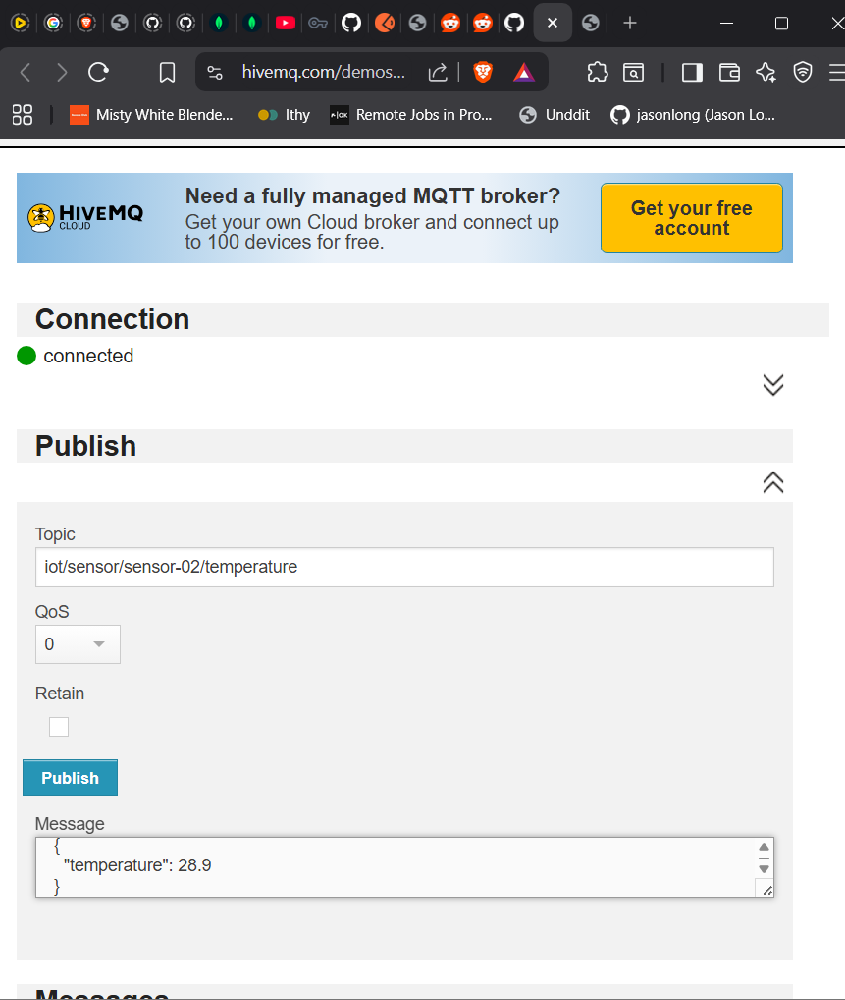

# IoT Sensor Backend

A Node.js backend service providing REST APIs and an MQTT subscriber for ingesting and retrieving IoT sensor temperature data.

## Features

- Ingest sensor temperature readings via REST API POST endpoint
- Real-time MQTT subscriber for sensor data from message broker
- Retrieve latest reading for any device via GET endpoint
- Input validation and error handling
- MongoDB Atlas integration for persistent storage

## Installation

Requires Node.js 18+/20/22 LTS.

```bash
git clone https://github.com/pranavthaivalappil/Faclon_Internship_Assignment.git
cd Faclon_Internship_Assignment
npm install
```

## Configuration

Create a `.env` file:

```env
MONGO_URI=mongodb+srv://<username>:<password>@cluster0.xxxxx.mongodb.net/iotSensors?retryWrites=true&w=majority
```

## Usage

Start the REST API server:

```bash
node app.js
```

Server runs on `http://localhost:3000`

Optionally, start the MQTT subscriber (in a separate terminal):

```bash
node mqttSubscriber.js
```

MQTT subscriber connects to `broker.hivemq.com` and listens for messages on topic pattern `iot/sensor/+/temperature`

## Data Schema

Sensor data is stored in MongoDB with the following fields:

- `deviceId` (String, required) - Unique identifier for the sensor device
- `temperature` (Number, required) - Temperature reading in degrees
- `timestamp` (Number, required) - Unix timestamp of the reading
- `createdAt` (Date) - Auto-generated document creation timestamp

## API Endpoints

### POST /api/sensor/ingest

Ingest sensor data.

Request body:
```json
{
  "deviceId": "sensor-01",
  "temperature": 30.5,
  "timestamp": 1707489234567
}
```

Response (201):
```json
{
  "message": "Sensor data ingested successfully"
}
```

### GET /api/sensor/:deviceId/latest

Retrieve latest reading for a device.

Response (200):
```json
{
  "_id": "698a08ae775d6aba42393a1a",
  "deviceId": "sensor-01",
  "temperature": 30.5,
  "timestamp": 1770653870571,
  "createdAt": "2026-02-09T16:17:50.578Z",
  "__v": 0
}
```

## Testing REST API

### Using Postman

#### POST Request - Successful Data Ingestion

POST to `http://localhost:3000/api/sensor/ingest` with header `Content-Type: application/json` and body:

```json
{
  "deviceId": "sensor-01",
  "temperature": 30.5
}
```


#### POST Request - Validation Error

POST request with missing `deviceId` to demonstrate validation (returns 400 error):


#### GET Request - Retrieve Latest Reading

GET `http://localhost:3000/api/sensor/sensor-01/latest`


## Testing MQTT

### Start MQTT Subscriber

```bash
node mqttSubscriber.js
```

Expected output:
```
MongoDB connected (MQTT)
Connected to MQTT broker
Subscribed to topic: iot/sensor/+/temperature
```

### Publish Test Message

Using HiveMQ Web Client (https://www.hivemq.com/demos/websocket-client/):

1. Connect to broker:
   - Host: `broker.hivemq.com`
   - Port: `8000`
   - Click Connect

2. Publish message:
   - Topic: `iot/sensor/sensor-02/temperature`
   - Message:
     ```json
     {
       "temperature": 28.9
     }
     ```
   - Click Publish



3. Check terminal output:
   ```
   Saved MQTT data for device: sensor-02
   ```

4. Verify in MongoDB Atlas or via REST API GET request in Postman:
   - GET `http://localhost:3000/api/sensor/sensor-02/latest`

The MQTT subscriber listens on topic pattern `iot/sensor/+/temperature` where `+` is a wildcard matching any deviceId.

## License

ISC

## Author

Pranav Thaivalappil  
[GitHub](https://github.com/pranavthaivalappil)
